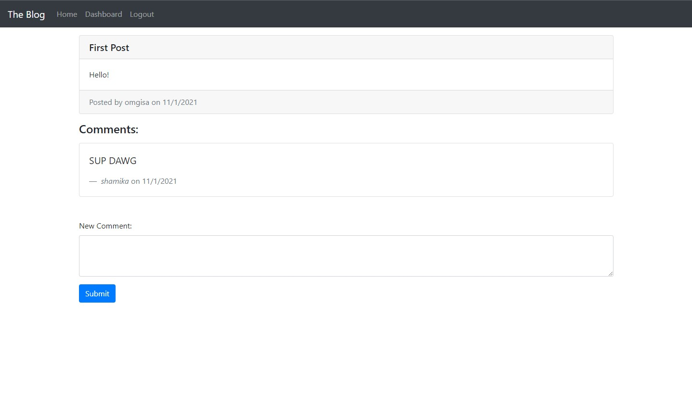

# Tech Blog

This app is a CMS-style blog site that people can publish their blog posts and comment on other's posts as well. This app follows the MVC (Model-View-Controller) paradigm in its architectural structure. It is using [Handlebars.js](https://handlebarsjs.com/guide/) as the template language, [Sequelize](https://sequelize.org/master/index.html) as the [ORM](https://en.wikipedia.org/wiki/Object%E2%80%93relational_mapping) (Object-Relational Mapping), and [express-session](https://www.npmjs.com/package/express-session) npm package for authentication. 

## Getting Started

### Prerequisites

* Must have a web browser and internet connection

## Built With

* [Javascript](https://developer.mozilla.org/en-US/docs/Web/JavaScript)
* [Bootstrap](https://getbootstrap.com/docs/4.6/getting-started/introduction/)
* [mysql2](https://www.npmjs.com/package/mysql2)
* [Sequelize](https://sequelize.org/master/index.html)
* [express-session](https://www.npmjs.com/package/express-session)
* [dotenv](https://www.npmjs.com/package/dotenv)
* [MySQL](https://dev.mysql.com/doc/refman/8.0/en/)
* [Handlebars](https://handlebarsjs.com/guide/)
* [bcrypt](https://www.npmjs.com/package/bcrypt)

## Deployed Link

* [See Live Site](https://glacial-atoll-88535.herokuapp.com/)

## Authors

* **Isaac Cortes Hernandez** 

- [Link to Portfolio Site](https://icortes.github.io/my-first-portfolio/)
- [Link to Github](https://github.com/icortes)
- [Link to LinkedIn](https://www.linkedin.com/in/cortes-isaac)

## License

This project is licensed under the MIT License 

## Acknowledgments

* stackoverflow